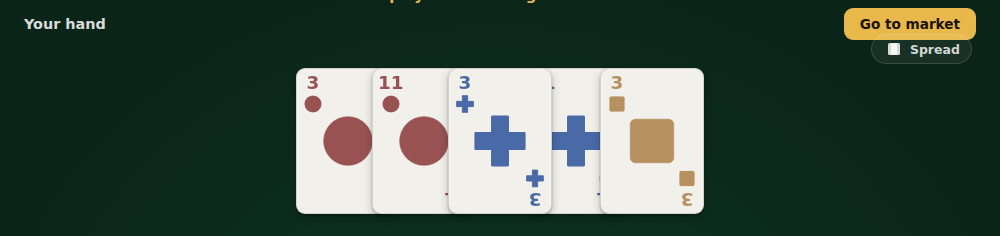
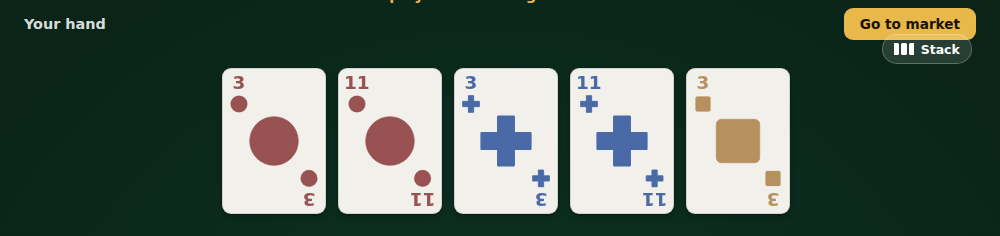
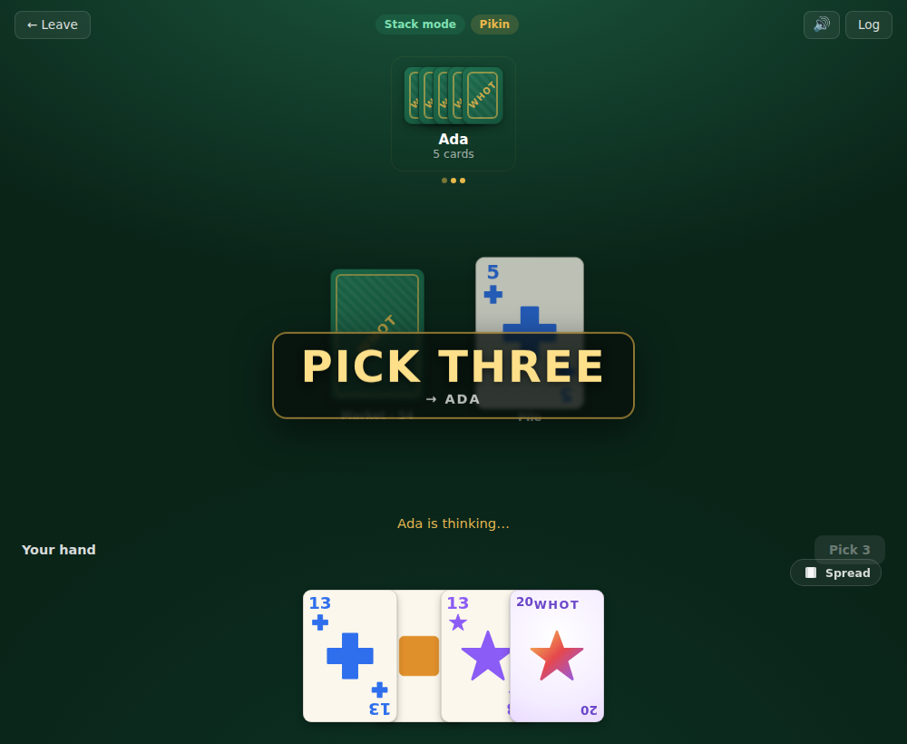
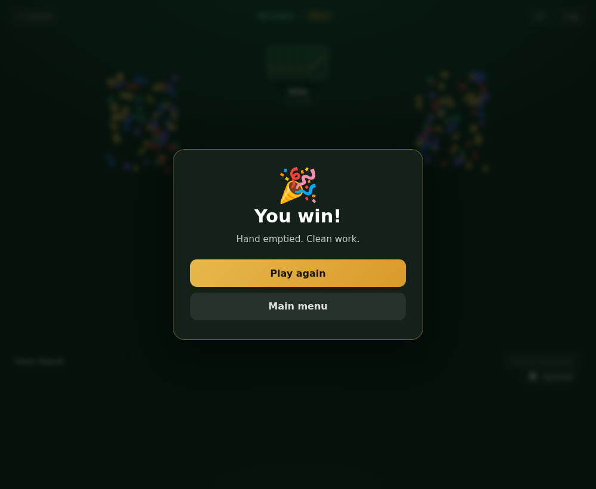

# Whot UI screenshots

Captured from the SvelteKit app (`app/`) playing a full single-player game.

| Screen | Preview |
| --- | --- |
| Main menu — mode, opponents, difficulty ladder |  |
| Your turn — playable cards highlighted, rest kept legible |  |
| Opponent's turn — "thinking" indicator, hand stays readable |  |
| Game over — result overlay |  |

## Hand layout toggle

The player's hand can switch between a compact overlapping fan and a fully
spread-out row (which scrolls to pan when it's wider than the screen).

| Held | Spread |
| --- | --- |
|  |  |

## Gamification

Action cards fire a punchy callout banner, penalties shake the board, and a win
sets off a confetti burst — all backed by a procedural (Web Audio) sound engine
with a mute toggle.

| Action callout | Win |
| --- | --- |
|  |  |
